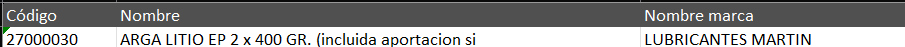

### 🤖 Image Scraper Automation (Opera GX Edition)
Módulo avanzado de automatización desarrollado por BenjaminDTS para la extracción, limpieza y descarga masiva de imágenes de productos utilizando Selenium, Undetected Chromedriver y el motor de búsqueda Bing.

## 📋 Descripción
Este script está diseñado para departamentos de e-commerce o gestión de inventarios que necesitan poblar sus bases de datos con imágenes reales. El sistema no solo busca el término, sino que:

Limpia el ruido: Elimina caracteres extraños de exportaciones corruptas de ERP.

Añade contexto: Inyecta palabras clave comerciales para evitar resultados irrelevantes (como PDFs o fotos de coches).

Optimiza: Redimensiona y comprime las imágenes para su uso directo en web.

## 🛠️ Requisitos e Instalación

### 1. Navegador
El script está preconfigurado para Opera GX. Si utilizas otro navegador, consulta la sección de Personalización.

### 2. Dependencias de Python
Instala las librerías necesarias ejecutando:

``` bash
pip install undetected-chromedriver selenium requests Pillow
```

## 📄 Especificaciones del CSV

Para que el robot procese los datos sin errores, el archivo de entrada debe seguir estas reglas:

### Formato Técnico

* **Nombre:** `ARTÍCULOS.csv`
* **Ubicación:** Misma carpeta que el script.
* **Delimitador:** Punto y coma (`;`).
* **Codificación:** `UTF-8 con BOM` (recomendado si exportas desde Excel).

Estructura de Columnas
El script realiza una detección inteligente de cabeceras, pero se recomienda usar:

| Cabecera | Requerido | Función |
| :--- | :---: | :--- |
| **CÓDIGO** | **SÍ** | Se usa como nombre del archivo final (ej: `12345.jpg`). |
| **NOMBRE** | **SÍ** | La descripción del producto para la búsqueda. |
| **NOMBRE MARCA** | No | Ayuda a filtrar la búsqueda (también detecta "MARCA" o "FABRICANTE"). |

Ejemplo visual de los datos:


## ⚙️ Guía de Adaptación (Uso en otros casos)
Si necesitas mover este script a otro entorno o usarlo para productos distintos, ajusta lo siguiente en el código:

### Cambiar la ruta del Navegador
En la función configuracion_opera_benjamin(), modifica la variable ruta_gx.

Para Chrome estándar, apunta a: C:\Program Files\Google\Chrome\Application\chrome.exe.

### Adaptar el Contexto Comercial
Si tu sector no es industrial/ferretero, edita la función contexto_comercial(texto). Por ejemplo, para una tienda de moda:

```Python
if "PANTALON" in texto:
    contexto = "ropa moda fotografia catalogo"
3. Versión del Navegador
En especificar_version(opciones), el parámetro version_main=143 está fijo. Si el script da error de "Driver version", actualiza ese número al de tu versión actual de Opera/Chrome o elimínalo para que sea automático.
```

## 🚀 Cómo ponerlo en marcha
Prepara tu ARTÍCULOS.csv con los productos deseados.

Ejecuta el script:

```Bash
python scraper_imagenes.py
```
Resultado: El script creará una carpeta llamada PRODUCTOS_WEB/. Si una imagen ya existe, el robot la saltará automáticamente para ahorrar ancho de banda.

## 📝 Notas de Autoría y Documentación
Autor: BenjaminDTS.

Documentación: El código está íntegramente comentado siguiendo los estándares de pydoc para su posterior exportación a manuales técnicos.

### 🤖 Image Scraper Automation (Opera GX Edition)
Advanced automation module developed by BenjaminDTS for extracting, cleaning, and bulk downloading product images using Selenium, Undetected Chromedriver, and the Bing search engine.

## 📋 Description
This script is designed for e-commerce or inventory management departments that need to populate their databases with real images. The system not only searches for the term but also:

Cleans the noise: Removes extraneous characters from corrupted ERP exports.

Adds context: Injects business keywords to avoid irrelevant results (such as PDFs or photos of cars).

Optimizes: Resizes and compresses images for direct use on the web.

## 🛠️ Requirements and Installation

### 1. Browser
The script is pre-configured for Opera GX. If you use another browser, see the Customization section.

### 2. Python Dependencies
Install the necessary libraries by running:

``` bash
pip install undetected-chromedriver selenium requests Pillow
```

## 📄 CSV Specifications

For the bot to process the data without errors, the input file must follow these rules:

### Technical Format

* **Name:** `ARTICLE.csv`
* **Location:** Same folder as the script.

* **Delimiter:** Semicolon (`;`).

* **Encoding:** `UTF-8 with BOM` (recommended if exporting from Excel).

Column Structure
The script performs intelligent header detection, but it is recommended to use:

| Header | Required | Function |
| :--- | :---: | :--- |
| **CODE** | **YES** | Used as the final file name (e.g., `12345.jpg`). |
**NAME** | **YES** | Product description for the search. |
**BRAND NAME** | No | Helps filter the search (also detects "BRAND" or "MANUFACTURER"). |

Visual example of the data:


## ⚙️ Adaptation Guide (Use in other cases)
If you need to move this script to another environment or use it for different products, adjust the following in the code:

### Change the Browser Path
In the configuration_opera_benjamin() function, modify the path_gx variable.

For standard Chrome, point to: C:\Program Files\Google\Chrome\Application\chrome.exe.

### Adapt the Business Context
If your sector is not industrial/hardware, edit the function `contexto_comercial(texto)`. For example, for a fashion store:

```Python
if "PANTALON" in texto:
context = "clothing fashion photography catalog"
3. Browser Version
In `specificar_version(opciones)`, the parameter `version_main=143` is fixed. If the script gives a "Driver version" error, update this number to match your current Opera/Chrome version or remove it to make it automatic.

```

## 🚀 How to get it up and running
Prepare your ARTICLE.csv file with the desired products.

Run the script:

```Bash
python scraper_imagenes.py
```
Result: The script will create a folder called `PRODUCTOS_WEB/`. If an image already exists, the crawler will automatically skip it to save bandwidth.

## 📝 Authorship and Documentation Notes
Author: BenjaminDTS

Documentation: The code is fully commented following pydoc standards for later export to technical manuals.
